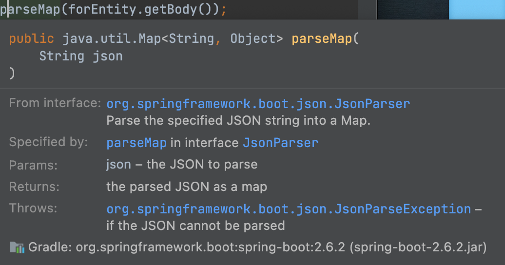
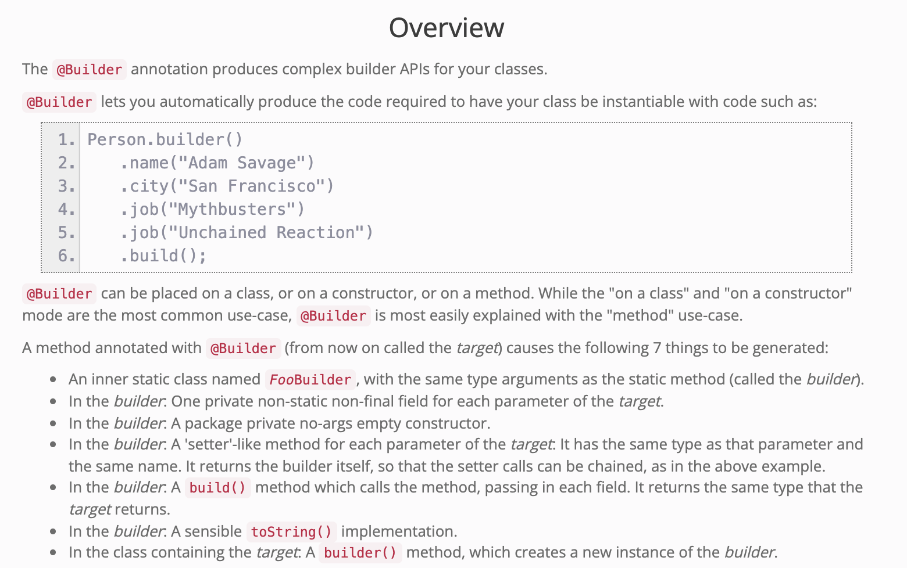

# What I learned

- Usage of belows
- Access Controller `private` 
- Modifier `static`
- `Json Object` 


## UriBuilder

```java
void urlBuilder() {
        String uri = "http://data4library.kr/api/loanItemSrch";

        UriComponents url = UriComponentsBuilder.fromHttpUrl(uri)
                .queryParam("authKey", "...")
                .queryParam("startDt", "2021-01-01")
                .queryParam("endDt", "2021-01-10")
                .queryParam("from_age", "20")
                .queryParam("page", "5")
                .queryParam("to_age", "40")
                .queryParam("format", "json")
                .build();
}
```


## RestTemplate

```java
        RestTemplate restTemplate = new RestTemplate();
        ResponseEntity<String> forEntity = restTemplate.getForEntity(url.toString(), String.class);
```


## BasicjsonParser

```java
        BasicJsonParser basicJsonParser = new BasicJsonParser();
        Map<String, Object> stringObjectMap = basicJsonParser.parseMap(forEntity.getBody());
```




## Object.get("key")

```java
        Map<String, Object> response = (Map<String, Object>) stringObjectMap.get("response");
        List<Map<String, Map<String, String>>> docs = (List<Map<String, Map<String, String>>>) response.get("docs");
```


## For-Each 

```java
        List<BookDTO> books = new ArrayList<>();
        for (Map<String, Map<String, String>> doc : docs) {
            Map<String, String> realDoc = doc.get("doc");

            BookDTO book = BookDTO.builder()
                    .ranking(realDoc.get("ranking"))
                    .authors(realDoc.get("authors"))
                    .bookName(realDoc.get("bookname"))
                    .build();
            books.add(book);
        }
```


## EntityBuilder

```java
        BookDTO book = BookDTO.builder()
          .ranking(realDoc.get("ranking"))
          .authors(realDoc.get("authors"))
          .bookName(realDoc.get("bookname"))
          .build();
```



## Full Version

```java
public class JsonParserTest {

    @Test
    void restTemplate() throws JsonProcessingException {
        String uri = "http://data4library.kr/api/loanItemSrch";

        UriComponents url = UriComponentsBuilder.fromHttpUrl(uri)
                .queryParam("authKey", "...")
                .queryParam("startDt", "2021-01-01")
                .queryParam("endDt", "2021-01-10")
                .queryParam("from_age", "20")
                .queryParam("page", "5")
                .queryParam("to_age", "40")
                .queryParam("format", "json")
                .build();


        RestTemplate restTemplate = new RestTemplate();
        ResponseEntity<String> forEntity = restTemplate.getForEntity(url.toString(), String.class);
        BasicJsonParser basicJsonParser = new BasicJsonParser();
        Map<String, Object> stringObjectMap = basicJsonParser.parseMap(forEntity.getBody());


        Map<String, Object> response = (Map<String, Object>) stringObjectMap.get("response");
        List<Map<String, Map<String, String>>> docs = (List<Map<String, Map<String, String>>>) response.get("docs");


        List<BookDTO> books = new ArrayList<>();
        for (Map<String, Map<String, String>> doc : docs) {
            Map<String, String> realDoc = doc.get("doc");

            BookDTO book = BookDTO.builder()
                    .ranking(realDoc.get("ranking"))
                    .authors(realDoc.get("authors"))
                    .bookName(realDoc.get("bookname"))
                    .build();
            books.add(book);
        }
    }

    @Builder
    public class BookDTO {
        private String ranking;
        private String bookName;
        private String authors;
    }
}
```


---


##### All Regards to...

>[BryceYangS](https://github.com/BryceYangS) 

