 # Refactoring repetitive codes

### login code refactoring

수정전 코드에서 성공에 대한 정보를 3군데(status, data, HttpStatus.OK ) 에서 중복으로 보내고 있습니다.. Client 는 어떤 정보를 써야 할까요? 의미가 모호해 집니다. HttpStatus.OK 한개만 쓰면 됩니다.

수정전

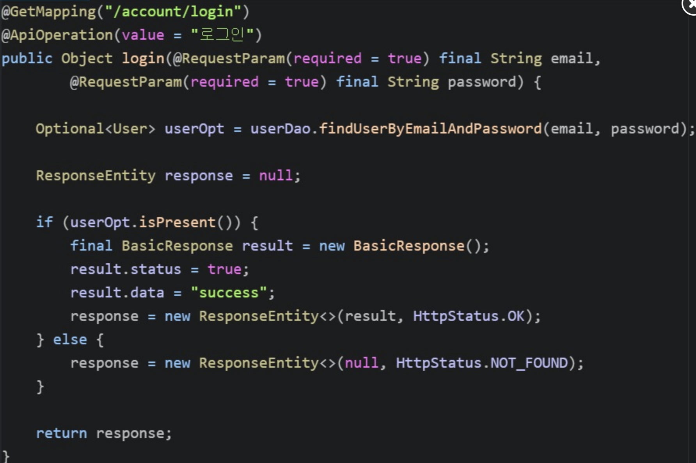

수정후

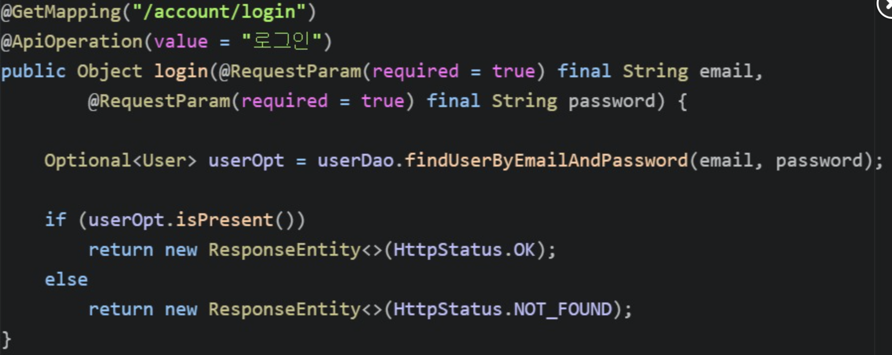

HTTP의 구조를 생각해 봅시다.

헤더에 상태코드를 반환하기 때문에 body에는 담을 필요가 없습니다. 지우는 것이 좋습니다.

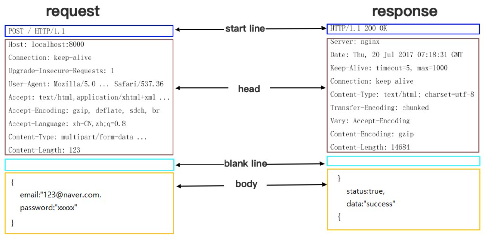

### **Use less Member Variables**

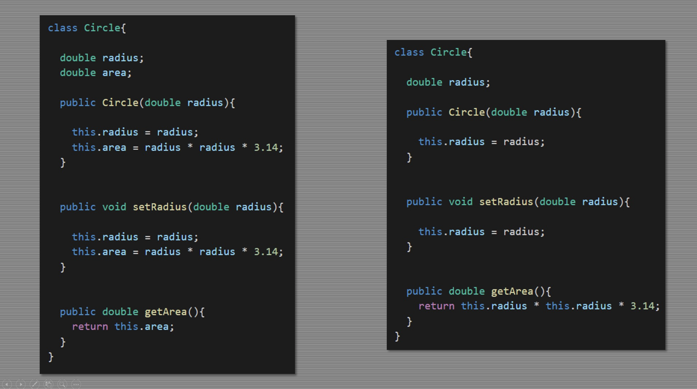

**멤버변수는 적을수록 좋습니다.**

왼쪽 코드에서 area 는 radius로 만들 수 있기 때문에, 따로 변수로 두지 않고 메서드로 만들 수 있습니다.

클래스 내에서 멤버변수가 많을수록 변수가 어떻게 사용될지 해석해야 하므로 가독성이 떨어지게 됩니다.

또한 에러가 발생할 확률도 우측이 낮은데, 좌측의 경우 실수로 radius만 변경하고 area를 변경하지 않는다면 에러가 날 것이기 때문입니다.

물론, 캐시를 사용한다면 왼쪽 코드가 더 빠릅니다. getArea 라는 함수를 빈번하게 호출한다면, 우측의 경우 코드를 실행할 때 마다 새로 연산을 해야하기 때문에 느려집니다.

따라서 상황에 맞게 코드 스타일을 선택해야 합니다. 속도가 중요하고 메서드가 빈번하게 호출되면 왼쪽을, 성능에 문제가 없고 가독성이 높은 코드를 개발하려면 우측을 선택하는 것이 좋습니다.

### Using Collections

비교문이 반복되고 결정된 동작의 패턴이 반복되면 collection 을 사용하세요.

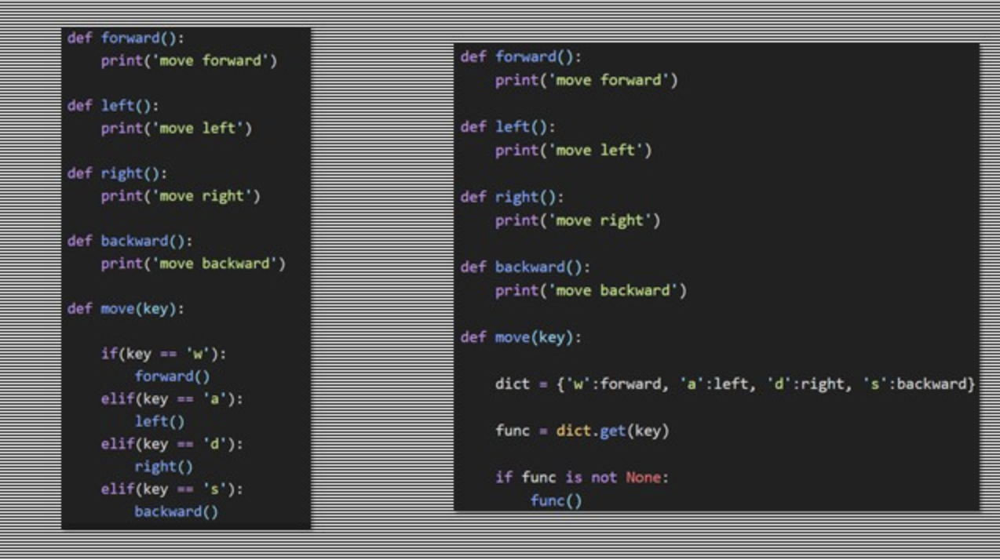

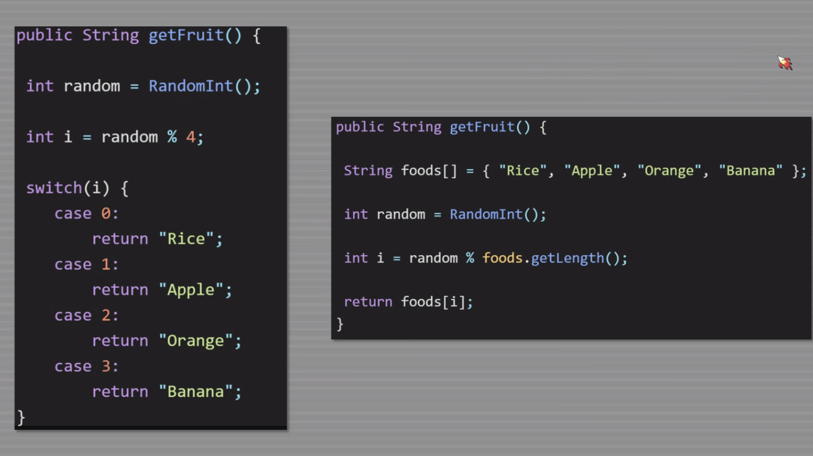

switch 문 대신 array에 넣을 수 있습니다.

case와 같이 비교 문이 연속적으로 이어지는 경우 return되는 경우

오른쪽과 같이 collection 을 활용해보세요.

비교문이 동일하게 반복되는 경우 collection 딕셔너리를 활용하여 key - value 를 1대1관계로 활용할 수 있습니다. 

## Less depth, better way.

함수의 진행 의미가 없다면 즉시 빠져나갑시다.

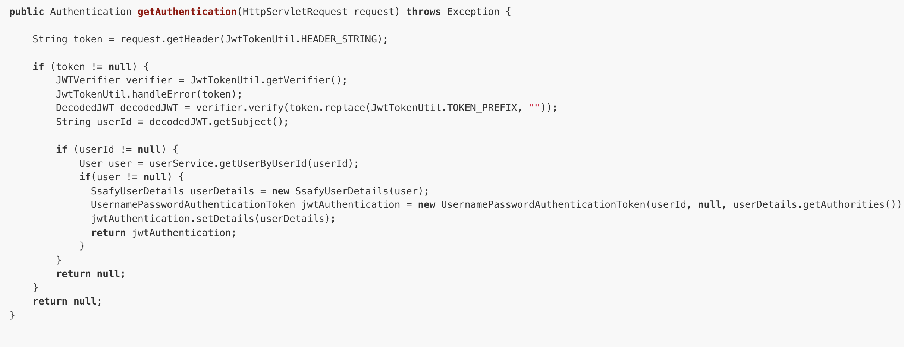

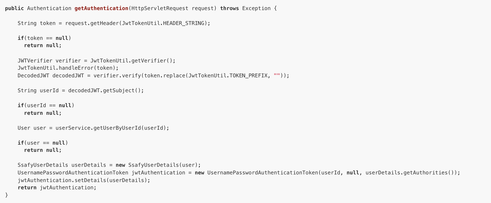

### Grouping Variables

멤버 변수가 많아지면 가독성이 떨어집니다.

같이 사용되는 변수가 어떤 것인지 보고, 모듈화를 통해 클래스를 만들어 재사용 가능하게 합시다.

함께 사용되는 변수들은 class 로 묶어줍시다.

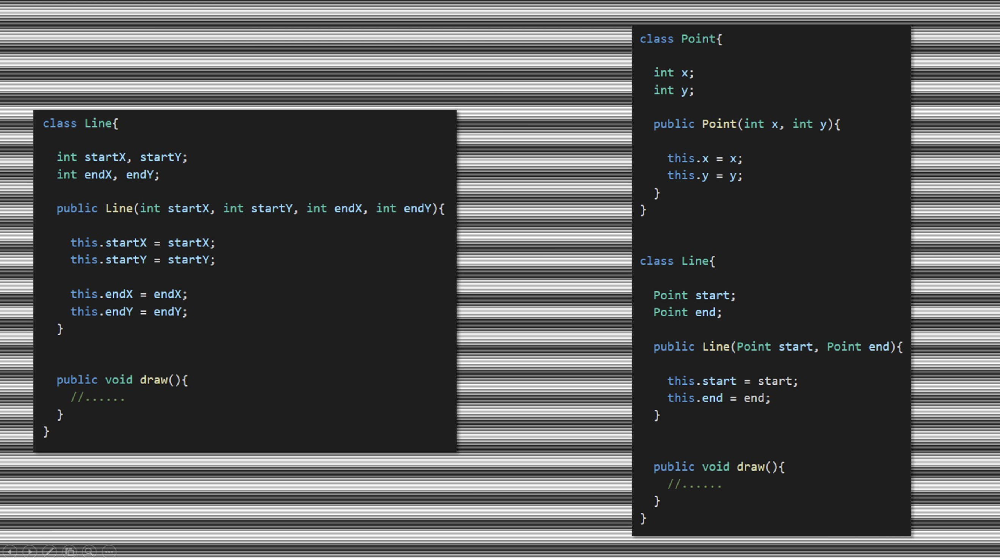

### D.R.Y (Don't Repeat Yourself) 

중복되는 코드는 별도의 함수로 만들어 사용합시다.

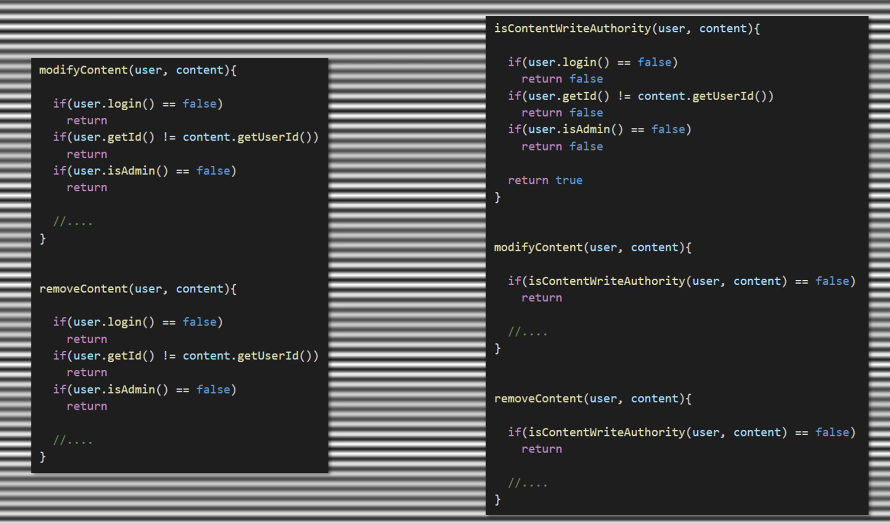

### Less feature, easier to understand

const < let < var 순으로 기능이 많아집니다.

코드를 작성할 때는 기능이 가장 적은 const를 우선적을 사용하고 그 다음으로 let, 마지막으로 var 를 사용합시다.

기능이 많을수록 가독성이 떨어지며 해석에 많은 시간이 걸립니다.

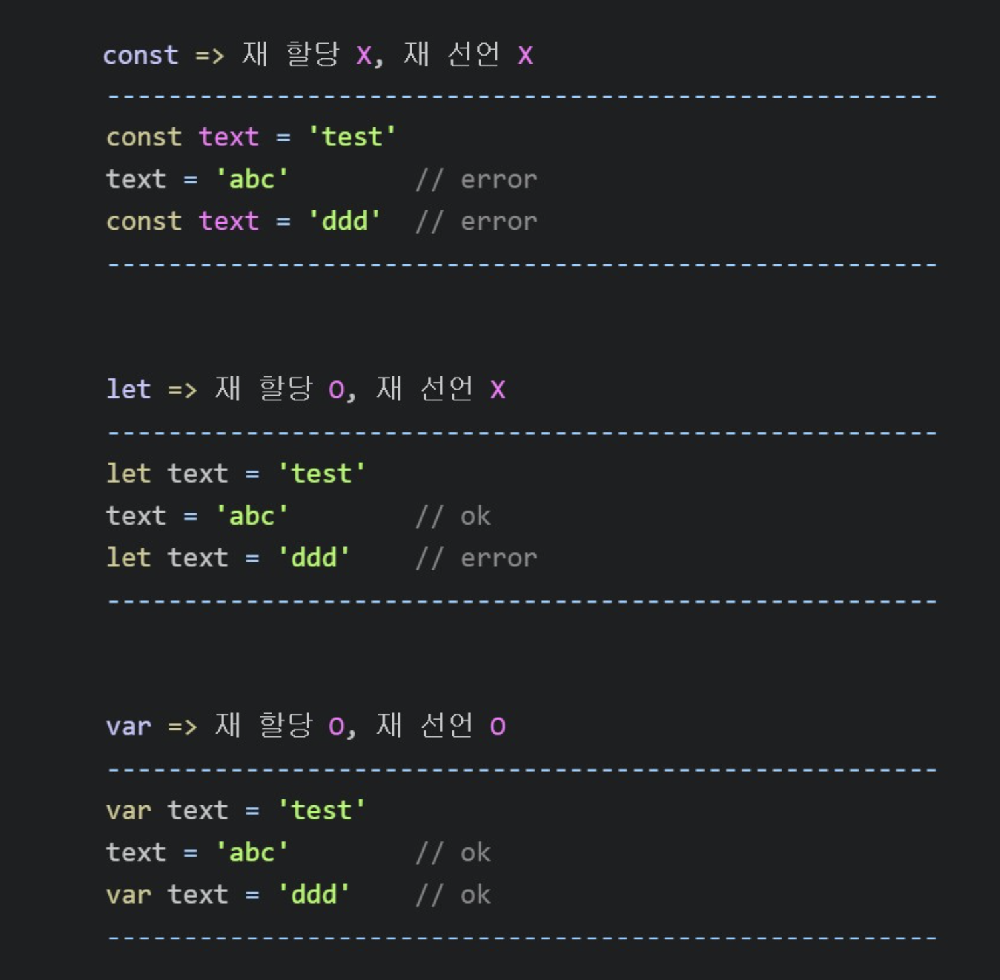

### Less concern

왼쪽 코드보다 오른쪽 코드가 더 단순합니다.

왼쪽 코드는 5번째 줄에서 srcFile.exists()가 true와 false 일 때 동작이 분기됩니다. 따라서 아래로 내려가며 해석할 때, false 조건일 때는 어떻게 동작할까? 라는 생각을 계속 상기해야하므로 더 복잡합니다.

오른쪽 코드는 srcFile.Exists가 false 이면 바로 함수를 빠져나가고, 나머지 코드는 모두 true에 해당한다고 단순하게 생각할 수 있습니다.

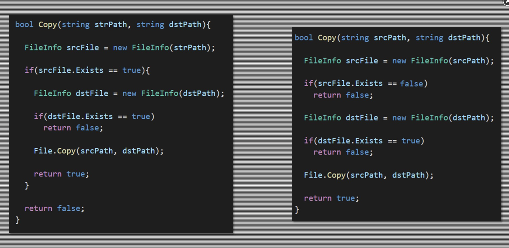
